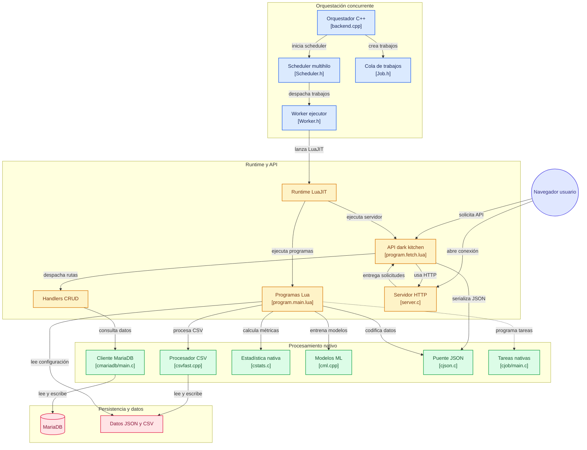

# 🚀 UniversalWare

> **UniversalWare** es un ecosistema de software híbrido de alto rendimiento diseñado para orquestar tareas concurrentes con baja latencia y control estricto de recursos. Combina la velocidad de C/C++ y librerías dinámicas (`.so`) con la agilidad de LuaJIT para la lógica de negocio.

---

## 📋 Tabla de Contenidos
- [Vista General](#-vista-general)
- [Caso de Uso: Dark Kitchen](#-caso-de-uso-dark-kitchen)
- [Arquitectura del Sistema](#-arquitectura-del-sistema)
- [Estructura Completa del Repositorio](#-estructura-completa-del-repositorio)
- [Requisitos del Sistema](#-requisitos-del-sistema)
- [Instalación y Uso](#-instalación-y-uso)
- [Herramientas CLI y Diagnóstico](#-herramientas-cli-y-diagnóstico)
- [Despliegue con Contenedores (Podman / Docker)](#-despliegue-con-contenedores-podman--docker)
- [Licencia](#-licencia)

---

## 📸 Vista General

El sistema está diseñado bajo el principio de **separación de responsabilidades**:
- **C++17 (`backend.cpp` + `libbackend/`)**: Orquestador principal multihilo que gestiona el pool de trabajadores (`Worker.h`), la cola de trabajos (`Job.h`, `Scheduler.h`) y la distribución (`Broker.h`).
- **Librerías Nativas y Dinámicas (`clibs/`, `cpplibs/`, `import/Linux/`)**: Módulos optimizados para MariaDB (`cmariadb.so`), multitarea/planificación (`cjob.so`), utilidades estadísticas (`cstats.so`), procesamiento CSV acelerado (`csvfast.so`), Machine Learning (`cml.so`) y utilidades SSH (`ssh.so`).
- **Módulos y Utilidades Lua (`import/`)**: Proporcionan abstracciones matemáticas/vectoriales (`Vector2`, `Vector3`, `Color3`, `Math`), compatibilidad con formatos (`json/cjson`, `csv/csvfast`, `base64`), enums visuales/animación (`EasingModes`).
- **LuaJIT (`program.main.lua`)**: Punto de entrada de alto nivel para ejecutar reglas de negocio e iteraciones dinámicas sin recompensar el núcleo.
- **Shell Automation (`run.sh`, `pods.sh`, `cmd`, `build.sh`)**: Automatización completa para CI/CD local, entorno interactivo REPL, compilación y despliegue.

---

## 🍕 Caso de Uso: Dark Kitchen

El repositorio incluye un caso de estudio enfocado en la gestión integral de una **Dark Kitchen** (cocina fantasma de alto volumen):
* **Ingesta de Pedidos en Tiempo Real:** Persistencia continua y lectura transaccional en MariaDB a través del módulo nativo `cmariadb.so`.
* **Carga Masiva de Menús e Inventarios:** Procesamiento e ingesta ultrarrápida de archivos CSV de insumos mediante `csvfast.so` y `csv.lua`.
* **Analítica y Proyecciones de Demanda:** De ser necesario, se puede incluir operaciones de modelado estocástico de pedidos e inventarios críticos combinando el rendimiento de `cstats.so` y `cml.so` para análisis de datos.
* **Orquestación Concurrente:** Procesamiento de comandas y ejecución de tareas pesadas en segundo plano mediante `cjob.so` y el motor multihilo de `libbackend/`.

---

## 🏗️ Arquitectura del Sistema



## 📂 Estructura Completa del Repositorio

```text
UniversalWare/
├── backend                   # Binario ejecutable compilado del orquestador
├── backend.cpp               # Orquestador principal en C++17
├── build.sh                  # Script de compilación de módulos C/C++ y librerías dinámicas
├── clibs/                    # Código fuente C de librerías nativas
│   ├── cjob/                 # Gestor/programador nativo de tareas (cjob.h, job.c, scheduler.c)
│   ├── cmariadb/             # Driver cliente MariaDB (clientmodes.h, datatypes.h, datatypes.c, main.c)
│   └── cstats.c              # Módulo C de cálculo estadístico
├── cmd                       # CLI para evaluar sentencias Lua directas
├── configurarentorno.sh      # Preparación de dependencias y venv
├── cpplibs/                  # Código fuente C++ de librerías dinámicas
│   ├── cml.cpp               # Módulo C++ para Machine Learning
│   └── csvfast.cpp           # Parser optimizado de archivos CSV
├── data/                     # Archivos de configuración y semillas de datos JSON
│   ├── guid_rand.json
│   └── rand_config.json
├── import/                   # Módulos, librerías y bins binarios para Lua
│   ├── base64.lua / bit32.lua
│   ├── Color3.lua / File.lua / Math.lua / String.lua / Table.lua
│   ├── json.lua / system.lua
│   ├── Lista.lua / Nodo.lua
│   ├── EasingModes.lua / Enum/ (EaseMode, Faces, FaceType, Shape, StyleMode)
│   ├── sublibs/               # Tipos vectoriales secundarios (Color3, Vector2, Vector3)
│   ├── Linux/                # Binarios dinámicos compilados (*.so) para Linux
│   │   └── nada.lua
│   └── Windows/              # Mapeo de compatibilidad para plataformas Windows
│       └── nada.lua
├── initconsole               # Consola REPL interactiva con entorno pre-cargado
├── libbackend/               # Motor multihilo Header-Only en C++
│   ├── Broker.h
│   ├── Job.h
│   ├── Scheduler.h
│   ├── ThreadPool.h
│   └── Worker.h
├── LICENCE                   # Licencia del proyecto
├── pods.sh                   # Helpers Bash para construcción y ejecución con Podman
├── program.main.lua          # Punto de entrada principal en Lua
├── README.md                 # Documentación del proyecto
├── runclient                 # Wrapper de ejecución del runtime LuaJIT
├── run.sh                    # Entrypoint principal de automatización
└── ubuntu_jammy.dockerfile   # Dockerfile no-root (usuario 'pc') basado en Ubuntu 22.04
```

---

## ⚙️ Requisitos del Sistema

- **Sistemas Operativos:** Linux (probado y optimizado en CachyOS / Arch Linux, compatible con Ubuntu 22.04 LTS).
- **Contenedores:** *Podman* (requerido para la compilación aislada y construcción del entorno/backend).
- **Compilador:** GCC / G++ con soporte completo para C++17.
- **Intérprete:** LuaJIT 2.1.178+.
- **Base de Datos:** MariaDB / MySQL Server (`mariadb-libs` en Arch/CachyOS o `libmariadb-dev` en Debian/Ubuntu).

---

## 🚀 Instalación y Uso

### 1. Clonar el repositorio
```bash
git clone https://github.com/tu-usuario/UniversalWare.git
cd UniversalWare
```

### 2. Ejecución Automatizada (Recomendado)
El script `run.sh` es **idempotente y tolerante a fallos**. Verificará dependencias, compilará componentes faltantes y ejecutará el ecosistema:

```bash
chmod +x run.sh
./run.sh
```

### 3. Compilación Manual de Módulos y `backend`
Para reconstruir los binarios nativos `.so` y el ejecutable principal:

```bash
chmod +x build.sh
./build.sh
```

---

## 🛠️ Herramientas CLI y Diagnóstico

### Consola Interactiva REPL (`initconsole`)
Abre una sesión activa de LuaJIT cargando automáticamente el entorno en `import/`:
```bash
./initconsole
```

### Ejecución de Comandos Directos (`cmd`)
Evalúa expresiones o archivos Lua manteniendo el contexto precargado:
```bash
./cmd "print('UniversalWare listo')"
```

---

## 🐳 Despliegue con Contenedores (Podman / Docker)

El proyecto incluye integración completa con **Podman** usando `ubuntu_jammy.dockerfile` (configurado con el usuario `pc` en `/home/pc`) y las funciones facilitadoras en `pods.sh`:

### 1. Cargar las funciones helper
```bash
source pods.sh
```

### 2. Compilar la imagen del contenedor
```bash
podmanbuild ubuntu_jammy.dockerfile universalware-env
```

### 3. Ejecutar el contenedor
La función `podmanrun` mapea el proyecto a `/home/pc` con el flag `--userns=keep-id`:

```bash
podmanrun universalware-env
```

Una vez dentro del contenedor:
```bash
cd RUTA_DE_UNIVERSAL_WARE
./configurarentorno.sh
```

Opcionalmente, puede iniciar el programa dentro del contenedor o en el sistema principal.
```bash
./run.sh
```
---

## 🎥 Demostración del Sistema


---

## 📄 Licencia

Este proyecto está bajo la Licencia **MIT** (o la especificada en el archivo [LICENCE](LICENCE)).
